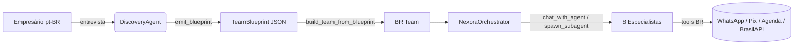

# BR Team — Sub-Agentes Brasileiros (`qwenpaw.agents.br_team`)

> **Status:** v1.0 — implementado, testado (69/69 testes verdes, sem regressão).
> **Localização do código:** `src/qwenpaw/agents/br_team/`
> **Skills associados:** `src/qwenpaw/agents/skills/br_*-pt/`
> **Testes:** `tests/unit/agents/br_team/`

---

## 1. Visão geral

O `DiscoveryAgent` (`src/qwenpaw/discovery/`) entrevista o dono da empresa e
emite um `TeamBlueprint` — apenas especificação dos agentes recomendados
(`proposed_team: list[AgentSpec]`). O pacote **`br_team`** materializa esse
blueprint em **sub-agentes ReAct concretos**, com prompts em pt-BR, toolkit
brasileiro (WhatsApp, Pix, agenda, CNPJ/CEP) e regras de compliance (LGPD,
CDC) embutidas.

### Fluxo end-to-end



---

## 2. Arquitetura

### 2.1 Estrutura de diretórios

```
src/qwenpaw/agents/br_team/
├── __init__.py              # API pública (lazy load)
├── prompts.py               # 9 system prompts pt-BR
├── orchestrator.py          # NexoraOrchestrator (ReActAgent)
├── factory.py               # resolve_role + build_team_from_blueprint
├── specialists/
│   ├── __init__.py
│   └── base.py              # BRSpecialistAgent + build_specialist
└── tools/
    ├── __init__.py          # re-exporta todas as tools
    ├── _utils.py            # text_response, json_response, err
    ├── whatsapp_tools.py    # 3 tools
    ├── agenda_tools.py      # 4 tools (in-memory store)
    ├── pagamento_tools.py   # 3 tools (Pix + link)
    └── cnpj_cep_tools.py    # 3 tools (DV local + stubs BrasilAPI)
```

### 2.2 Camadas

| Camada | Responsabilidade | Arquivos |
|---|---|---|
| **L0 — Tools** | I/O com mundo externo. Stubs assíncronos com contrato fixo (`ToolResponse`). | `tools/*.py` |
| **L1 — Prompts** | Identidade pt-BR + regras invioláveis de cada papel. | `prompts.py` |
| **L2 — Especialistas** | `ReActAgent` configurado com prompt + tools do papel. | `specialists/base.py` |
| **L3 — Factory** | Mapeia blueprint do discovery (texto livre) em especialistas concretos. | `factory.py` |
| **L4 — Orquestrador** | Roteia intenções para o especialista certo via API local. | `orchestrator.py` |
| **L5 — Skills (qwenpaw)** | SKILL.md com triggers/contratos para o sistema de skills. | `agents/skills/br_*-pt/` |

### 2.3 Decisões-chave

1. **Stubs com contrato estável.** Cada tool externa (WhatsApp, Pix, CNPJ)
   é stub determinístico hoje. A troca para integração real (Z-API,
   Mercado Pago, BrasilAPI) **não muda assinatura** — agentes e testes
   ficam intactos.
2. **Uma classe `BRSpecialistAgent` para todos os papéis.** O que muda é
   prompt + subset de tools. Reduz boilerplate sem perder especialização.
3. **Orquestrador é Hub-and-Spoke**, não in-process. Usa as tools nativas
   `list_agents` / `chat_with_agent` / `submit_to_agent` / `spawn_subagent`
   já presentes em `qwenpaw.agents.tools.agent_management`. Cada
   especialista pode rodar no seu próprio `Workspace`, com canais
   próprios (WhatsApp, Telegram etc.).
4. **`resolve_role` é tolerante.** Trabalha em texto pt-BR livre,
   sem acento, e prioriza contexto de saúde (clínica/consultório/médico)
   sobre agendamento genérico.

---

## 3. API pública

### 3.1 Imports principais

```python
from qwenpaw.agents.br_team import (
    NexoraOrchestrator,        # orquestrador
    SPECIALIST_REGISTRY,       # dict[role -> factory]
    SpecialistFactory,         # tipo
    build_team_from_blueprint, # blueprint -> time
)
from qwenpaw.agents.br_team.factory import resolve_role
from qwenpaw.agents.br_team.specialists.base import (
    BRSpecialistAgent,
    build_specialist,
    TOOLS_BY_ROLE,
)
from qwenpaw.agents.br_team.prompts import PROMPTS_BY_ROLE
```

### 3.2 `build_team_from_blueprint(blueprint, instantiate=True)`

Materializa o blueprint do `DiscoveryAgent` em sub-agentes.

```python
from qwenpaw.discovery import build_discovery_agent
from qwenpaw.agents.br_team import build_team_from_blueprint

# blueprint produzido pela entrevista (TeamBlueprint)
result = build_team_from_blueprint(blueprint, instantiate=True)

# result.specialists: list[BRSpecialistAgent]
# result.role_map: dict[str, str]  -> {"Bia": "atendente", ...}
# result.skipped: list[dict]       -> specs sem casamento
```

Use `instantiate=False` para **preview sem custo de modelo** (útil em
CLI/dashboard).

### 3.3 `NexoraOrchestrator()`

```python
from qwenpaw.agents.br_team import NexoraOrchestrator
from agentscope.message import Msg

orchestrator = NexoraOrchestrator()
resp = await orchestrator.reply(
    Msg(
        name="user",
        content=(
            "Cliente Maria (+5511999998888) mandou: "
            "'quero marcar corte feminino pra sexta de manhã'"
        ),
        role="user",
    ),
)
```

O orquestrador chamará `list_agents` → identificará intenção
"agendar" → `chat_with_agent(to_agent="agendamento", ...)` →
sintetizará a resposta.

### 3.4 `build_specialist(role, name=None, extra_tools=None)`

Constrói um especialista isolado.

```python
from qwenpaw.agents.br_team.specialists.base import build_specialist

vendedor = build_specialist(
    role="vendas",
    name="VendedorEcommerce",
    extra_tools=[minha_tool_de_estoque_real],
)
```

Papéis válidos: `atendente`, `agendamento`, `vendas`, `suporte`,
`marketing`, `catalogo`, `financeiro`, `recepcionista_saude`.

---

## 4. Os 8 especialistas

### 4.1 Tabela-resumo

| Papel | Emoji | Foco | Tools |
|---|---|---|---|
| `atendente` | 💬 | Primeiro contato WhatsApp, classifica intenção | `send_whatsapp_message/image`, `consultar_cep`, `validar_cpf` |
| `agendamento` | 📅 | Agenda + anti-no-show | `list_available_slots`, `book_appointment`, `send_appointment_reminder`, `send_whatsapp_template` |
| `vendas` | 💰 | Qualificação + fechamento | `gerar_link_pagamento`, `gerar_cobranca_pix`, `consultar_status_pagamento`, `send_whatsapp_template`, `consultar_cnpj` |
| `suporte` | 🛟 | Pós-venda, CDC art. 49 | `consultar_status_pagamento`, `send_whatsapp_template`, `consultar_cep` |
| `marketing` | 📣 | Campanha HSM (fora 24h) | `send_whatsapp_template`, `send_whatsapp_image` |
| `catalogo` | 🛒 | Produto/cardápio/estoque | `send_whatsapp_message/image` |
| `financeiro` | 💸 | Pix, link, conciliação | `gerar_cobranca_pix`, `gerar_link_pagamento`, `consultar_status_pagamento`, `validar_cpf`, `consultar_cnpj` |
| `recepcionista_saude` | 🩺 | Clínica + **LGPD art. 11** | agenda + `validar_cpf` + template (NUNCA discute queixa clínica) |

### 4.2 Mapa intenção → especialista (usado pelo orquestrador)

```
dúvida geral / primeiro contato     → atendente
"marcar" / "agendar" / "horário"     → agendamento
"comprar" / "orçamento" / "preço"    → vendas
"rastrear" / "trocar" / "cancelar"   → suporte
"pagar" / "pix" / "boleto"           → financeiro
"cardápio" / "estoque" / "produto X" → catalogo
"campanha" / "post" / "promo"        → marketing
qualquer pedido em clínica/médico    → recepcionista_saude
```

### 4.3 Heurística `resolve_role`

`factory.resolve_role(spec_role, spec_name)` casa texto pt-BR livre:

| Entrada | Saída |
|---|---|
| `"Atendente WhatsApp"` | `atendente` |
| `"SAC"`, `"primeiro contato"` | `atendente` |
| `"Agendamento de consultas"` | `agendamento` |
| `"Recepção da clínica"` | `recepcionista_saude` (contexto saúde) |
| `"Secretaria médica"` | `recepcionista_saude` |
| `"Vendedor consultivo"`, `"Comercial B2B"`, `"Recuperação de carrinho"` | `vendas` |
| `"Suporte pós-venda"`, `"Ouvidoria"` | `suporte` |
| `"Marketing & social media"`, `"Fidelização"` | `marketing` |
| `"Catálogo"`, `"Cardápio"` | `catalogo` |
| `"Financeiro"`, `"Cobrança"`, `"Pix e boleto"` | `financeiro` |
| `"Astrofísico do espaço sideral"` | `None` (vai para `result.skipped`) |

**Priorização:** se houver palavra de contexto de saúde (`clinica`,
`consultorio`, `medico`, `medica`, `dentista`, `odonto`, `saude`,
`paciente`) no role ou nome, `agendamento`/`atendente` são **elevados**
para `recepcionista_saude` automaticamente.

---

## 5. Toolkit brasileiro

### 5.1 WhatsApp (`tools/whatsapp_tools.py`)

| Tool | Quando usar |
|---|---|
| `send_whatsapp_message(phone, message)` | Resposta livre **dentro** da janela de 24h |
| `send_whatsapp_template(phone, template_name, variables=None)` | Mensagem proativa **fora** da janela 24h (HSM aprovado) |
| `send_whatsapp_image(phone, image_url, caption="")` | Foto de produto/comprovante/cardápio |

**Normalização de telefone:** aceita `"11999998888"` ou `"+5511999998888"`;
adiciona `+55` automaticamente para 10–11 dígitos.

**Stub:** logger registra envio; troca real plugar em
`qwenpaw.app.channels.whatsapp.channel.WhatsAppChannel` ou provedor
externo (Z-API, Evolution, Twilio, WhatsApp Cloud API).

### 5.2 Agenda (`tools/agenda_tools.py`)

Store **in-memory** (dict global) com lock — suficiente para
dev/test/demo do orquestrador. Em produção, plugar em Google
Calendar, Outlook, Doctoralia, Trinks.

| Tool | Descrição |
|---|---|
| `list_available_slots(agenda_id, date, slot_minutes=30, business_hours_start=9, business_hours_end=18)` | Lista ISO de horários livres no dia |
| `check_slot_availability(agenda_id, slot_iso)` | Confere 1 slot específico |
| `book_appointment(agenda_id, slot_iso, customer_name, customer_phone, service="", notes="")` | Reserva → retorna `booking_id="apt-..."` |
| `send_appointment_reminder(booking_id, hours_before=24)` | Agenda lembrete (em prod: APScheduler já em deps) |

### 5.3 Pagamento (`tools/pagamento_tools.py`)

| Tool | Descrição |
|---|---|
| `gerar_cobranca_pix(valor_centavos, descricao, devedor_nome="", devedor_cpf="", expira_em_minutos=30)` | Gera txid Pix + QR copia-e-cola (stub) |
| `gerar_link_pagamento(valor_centavos, descricao, metodos="pix,credit_card,boleto", expira_em_horas=24)` | Link de checkout |
| `consultar_status_pagamento(payment_id)` | `pending` / `paid` / `expired` / `cancelled` |

CPF é **validado por DV** quando fornecido. Troca real: Gerencianet,
Mercado Pago, Asaas, PagBank, Stripe BR.

### 5.4 CNPJ / CEP / CPF (`tools/cnpj_cep_tools.py`)

| Tool | Implementação |
|---|---|
| `validar_cpf(cpf)` | **Local** — dígito verificador (sem rede) |
| `consultar_cnpj(cnpj)` | Stub formato BrasilAPI; valida DV local antes |
| `consultar_cep(cep)` | Stub formato BrasilAPI/ViaCEP |

Stubs já retornam **estrutura compatível com BrasilAPI**, então
substituição é trocar 1 linha (`httpx.get(...)`).

---

## 6. System prompts (pt-BR)

Todos em `prompts.py`, dict `PROMPTS_BY_ROLE`.

### 6.1 Padrão comum (`_TOM_BR + _REGRAS_GERAIS`)

- Português do Brasil; "você" (não "tu"); tom acolhedor.
- **Nunca inventar** preço/horário/política/prazo.
- Confirma dados sensíveis antes de salvar.
- **LGPD minimizada**: não pede senha, código completo de cartão, foto
  de documento sem necessidade.
- Escalonamento: `chat_with_agent` para outro especialista, ou
  "vou passar para um atendente".

### 6.2 Reforços por papel

- **Atendente** — uma pergunta por vez; reclamação ácida ⇒ humano.
- **Agendamento** — NUNCA confirma sem `book_appointment` OK.
- **Vendas** — NUNCA inventa desconto; negociação ⇒ humano.
- **Suporte** — CDC art. 49 (7 dias de arrependimento); reembolso só
  se status = paid.
- **Marketing** — max 1 promo/semana sem aprovação; opt-out obrigatório.
- **Catálogo** — preço sem fonte = "sujeito a confirmação"; nunca
  inventa foto.
- **Financeiro** — NUNCA pede dados completos do cartão por chat.
- **RecepcionistaSaude** — LGPD art. 11 (dado sensível); **nunca**
  discute queixa clínica/resultado em chat; emergência ⇒ orienta
  PS/**SAMU 192** + escala humano.
- **Orchestrator** — SEMPRE `list_agents` antes; nunca chama de volta
  quem te chamou (anti-loop); paraleliza com `submit_to_agent`.

---

## 7. Skills do qwenpaw (formato `SKILL.md`)

9 skills criados em `src/qwenpaw/agents/skills/`:

```
br_orchestrator-pt/SKILL.md         🇧🇷
br_atendente-pt/SKILL.md            💬
br_agendamento-pt/SKILL.md          📅
br_vendas-pt/SKILL.md               💰
br_suporte-pt/SKILL.md              🛟
br_marketing-pt/SKILL.md            📣
br_catalogo-pt/SKILL.md             🛒
br_financeiro-pt/SKILL.md           💸
br_recepcionista_saude-pt/SKILL.md  🩺
```

Cada um tem frontmatter no padrão do skill `make-skill`:

```yaml
---
name: br_<papel>
description: "..."         # triggers (frases que disparam o skill)
when_to_use: "..."
metadata:
  builtin_skill_version: "1.0"
  qwenpaw:
    emoji: "..."
    requires: {}
---
```

---

## 8. Testes (`tests/unit/agents/br_team/`)

| Arquivo | Cobertura | Testes |
|---|---|---|
| `test_tools.py` | WhatsApp (envio/normalização/validação), Agenda (CRUD + conflito + lembrete), Pagamento (Pix DV CPF + status), CNPJ/CEP/CPF | 24 |
| `test_factory.py` | `resolve_role` (16 sinônimos), registry completo, `build_team_from_blueprint` (sem instanciar modelo) | 21 |
| `test_prompts.py` | Existência, pt-BR, LGPD/SAMU em saúde, template HSM em marketing, anti-loop em orquestrador | 24 |
| **Total** | | **69** |

**Sem dependência de LLM.** Todos os testes rodam offline, em <2s,
sem chamar nenhum modelo. A factory tem caminho `instantiate=False`
para preview puro.

```powershell
# rodar apenas o pacote BR
python -m pytest tests/unit/agents/br_team/ -q

# rodar suite agentes + discovery (sem regressão)
python -m pytest tests/unit/agents/ tests/unit/discovery/ -q
```

---

## 9. Integração com o resto do qwenpaw

### 9.1 O que **já está** plugado

- ✅ Modelo do workspace via `create_model_and_formatter()` —
  mesma estratégia do `discovery/agent.py`.
- ✅ Tools nativas de coordenação inter-agente do qwenpaw
  (`list_agents`, `chat_with_agent`, etc.) consumidas pelo
  `NexoraOrchestrator`.
- ✅ `TeamBlueprint` (Pydantic) lido pela factory.
- ✅ Sistema de skills `make-skill` — manifesto compatível.

### 9.2 O que **falta** plugar (decisões do usuário)

| Item | Onde plugar |
|---|---|
| **WhatsApp real** | `whatsapp_tools.py` → chamar `WhatsAppChannel.send_message_to(...)` em `app/channels/whatsapp/channel.py` |
| **BrasilAPI real** | `cnpj_cep_tools.py` → `httpx.AsyncClient().get("https://brasilapi.com.br/api/cnpj/v1/{cnpj}")` |
| **Gateway Pix real** | `pagamento_tools.py` → provider (Gerencianet/MP/Asaas) |
| **Google Calendar real** | `agenda_tools.py` → trocar dict in-memory por API |
| **Auto-registro em `MultiAgentManager`** | gerar `agent.yaml` para cada especialista e adicionar à config |
| **CLI** | `qwenpaw team build --blueprint <path>` em `src/qwenpaw/cli/` |
| **Auto-pipeline** | ao final da entrevista, `DiscoveryAgent.emit_blueprint` pode chamar `build_team_from_blueprint` e devolver os IDs dos agentes criados |

---

## 10. Extensão: adicionar um novo especialista

1. **Prompt** → adicione `MEU_PROMPT = "..."` em `prompts.py` e registre
   em `PROMPTS_BY_ROLE["meu_papel"] = MEU_PROMPT`.
2. **Tools do papel** → adicione `"meu_papel": [tool1, tool2, ...]` em
   `TOOLS_BY_ROLE` em `specialists/base.py`.
3. **Sinônimos pt-BR** → adicione tupla em `_ROLE_KEYWORDS` em
   `factory.py` (ordem importa para casos ambíguos).
4. **Skill** → crie `src/qwenpaw/agents/skills/br_meu_papel-pt/SKILL.md`
   no mesmo padrão dos existentes.
5. **Teste** → adicione casos em `test_factory.py::test_resolve_role_...`
   e em `test_prompts.py`.

A entrada em `SPECIALIST_REGISTRY` é gerada **automaticamente** a partir
de `PROMPTS_BY_ROLE` — nenhum boilerplate extra.

---

## 11. Compliance embarcado

- **LGPD** — minimização de dados em todos os prompts; bloqueio explícito
  de queixa clínica no chat (`recepcionista_saude`); validação local de
  CPF (sem enviar a serviço externo só para validar).
- **CDC art. 49** — política de 7 dias de arrependimento citada no
  prompt de `suporte`.
- **WhatsApp Business policy** — separação rígida `send_whatsapp_message`
  (dentro 24h) × `send_whatsapp_template` (fora 24h, HSM); usado pelo
  prompt de `marketing`.
- **Emergência médica** — `recepcionista_saude` orienta SAMU 192 e
  escala humano em palavras-chave como "forte dor", "sangrando",
  "desmaio".

---

## 12. Checklist de release v1.0

- [x] 12 arquivos de código em `br_team/`
- [x] 9 SKILL.md em `agents/skills/br_*-pt/`
- [x] 69 testes unitários (offline, sem LLM)
- [x] `flake8` zero issues nos arquivos novos
- [x] 588 testes pré-existentes (`agents/`+`discovery/`) passando
- [x] Documentação (este arquivo)
- [ ] Provedores reais (WhatsApp/BrasilAPI/Pix) — handoff para usuário
- [ ] CLI `qwenpaw team build` — handoff
- [ ] Registro auto no `MultiAgentManager` — handoff
- [ ] Testes de integração ponta-a-ponta com modelo real — handoff

---

## 13. Plugin `nexora-team` (v1.0)

Foi adicionado o plugin instalável **`nexora-team`** em
`plugins/bundle/nexora-team/`, que materializa este pacote dentro do
QwenPaw — fechando o item "registro auto no `MultiAgentManager`" do
checklist acima.

### O que o plugin faz

1. **Registra 5 agentes** (`nexora-orchestrator`, `nexora-atendente`,
   `nexora-agendamento`, `nexora-vendas`, `nexora-financeiro`)
   via `save_agent_config`, com workspace dedicado em
   `<WORKING_DIR>/workspaces/<agent_id>` e `PERSONA.md` semeada
   diretamente do `PROMPTS_BY_ROLE` do `br_team`.
2. **Publica a ferramenta `convene_meeting`** — paraleliza
   `chat_with_agent` para N especialistas e devolve a transcrição.
3. **Expõe API HTTP** em `/api/nexora-team/`:
   - `GET /team`, `POST /team/build` (preview do `TeamBlueprint`)
   - `POST /meeting`, `GET /meeting`, `GET /meeting/{id}`,
     `DELETE /meeting`, `GET /meeting/_/participants`
4. **Ship do skill `nexora-meeting-pt`** instalado no skill pool
   e linkado ao workspace do orquestrador.
5. **Hook de uninstall** remove perfis + workspaces + skill.

### Arquitetura

```
plugins/bundle/nexora-team/
├── plugin.json
├── plugin.py           ← NexoraTeamPlugin
├── constants.py        ← 5 AGENT_SPECS + role map
├── agents_setup.py     ← ensure_builtin_agents / uninstall_agents
├── routers_setup.py
├── routers/{team,meeting}.py
├── tools/meeting_tools.py
├── store/meetings.py   ← MeetingStore (thread-safe, evict 200)
└── skills/nexora-meeting-pt/SKILL.md
```

### Testes

- 34 testes verdes em `tests/unit/plugins/nexora_team/`
  (store, tool com stub, routers via TestClient, smoke do manifest)
- 103/103 passando incluindo o `br_team` original — sem regressão
- flake8 limpo

### Por que `convene_meeting` em vez de só `chat_with_agent`?

`chat_with_agent` é hand-off sequencial — bom para "passa essa
pergunta para o Vendas". `convene_meeting` é **stand-up paralelo** —
serve quando o caso toca múltiplos departamentos e você quer todas
as opiniões antes de responder ao cliente. Cada contribuição vai
com `elapsed_ms`, captura `timeout`/`exception` por agente, e o
sumário fica em `MeetingStore` para auditoria (LGPD ART. 37).

Detalhes completos: [`plugins/bundle/nexora-team/README.md`](../plugins/bundle/nexora-team/README.md).

